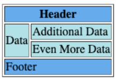

# Instructions

Using the image as reference, replace the `< ? >`` tag by the appropriate tag to forms the html table:

# Reference



# Code

```
< ? >
    < ? >
        < ? >
            < ? ?="2"> Header </ ? >
        </ ? >
    </ ? >
    < ? >
        < ? >
            < ? ?="2"> Data </ ? >
            < ? > Additional Data </ ? >
        </ ? >
        < ? >
            < ? > Even More Data </ ? >
        </ ? >
    </ ? >
    < ? >
        < ? >
            < ? ?="2"> Footer </ ? >
        </ ? >
    </ ? >
</ ? >
```
