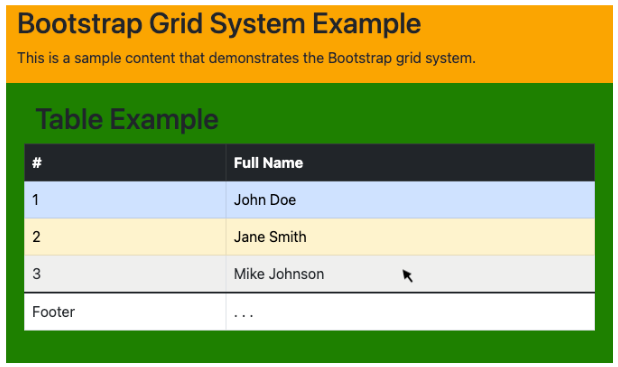

# Instructions

Here an example of a Bootstrap grid system with a table that incorporates the provided styling classes. The grid has two sections with different colors. The third row of the table has the mouse pointing at it. Determine the class and style type by replacing the ??? in the Javascript code.

# Reference



# Code

```
<div class="???">
    <!-- Grid columns -->
    <div class="???">
        <!-- Grid row -->
        <div class="???" style="???: orange">
            <h2>Bootstrap Grid System Example</h2>
            <p>This is a sample content that demonstrates the Bootstrap grid system.</p>
        </div>
        <div class="???" style="background-color: ???; ???: 20px">
            <h2>Table Example</h2>
            <table class="???  ???  ???">
                <thead>
                    <tr class="???">
                        <th>#</th>
                        <th>Full Name</th>
                    </tr>
                </thead>
                <tbody>
                    <tr class="???">
                        <td>1</td>
                        <td>John Doe</td>
                    </tr>
                    <tr class="???">
                        <td>2</td>
                        <td>Jane Smith</td>
                    </tr>
                    <tr>
                        <td>3</td>
                        <td>Mike Johnson</td>
                    </tr>
                </tbody>
                <tfoot class="???">
                    <tr>
                        <td>Footer</td>
                        <td>. . .</td>
                    </tr>
                </tfoot>
            </table>
        </div>
    </div>
</div>

```
